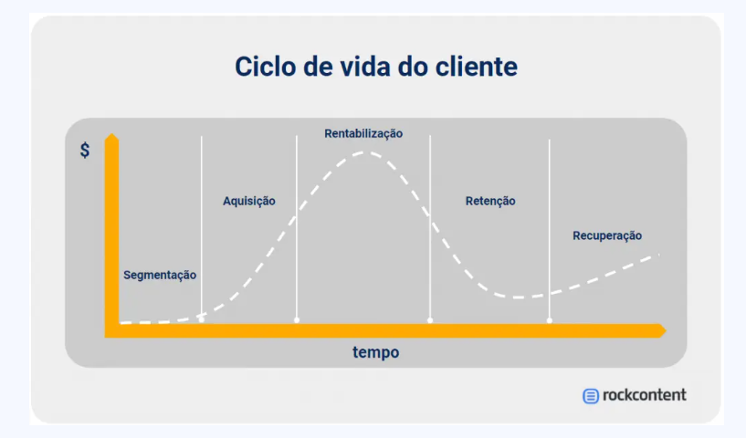

# Planejamento: 

## Objetivo e Diagnóstico

O CRM é uma estratégia que as empresas usam para melhorar o relacionamento com seus clientes. 

O objetivo é entender as necessidades dos clientes e oferecer um atendimento personalizado, para que eles fiquem satisfeitos e se tornem clientes fiéis.

O planejamento do CRM é uma etapa importante nessa estratégia. Ele envolve definir os objetivos que a empresa quer alcançar, como aumentar o número de clientes, reter mais clientes ou aumentar a rentabilidade dos clientes existentes. Para fazer um bom planejamento, é necessário ter dados sobre os clientes, como histórico de compras, pesquisas de satisfação e informações sobre a concorrência.

O diagnóstico é outra etapa do planejamento do CRM. É quando a empresa analisa sua situação atual, como a quantidade de clientes ativos e inativos, o valor médio das compras e a frequência de compra. Essas informações ajudam a identificar oportunidades de melhoria e a tomar decisões estratégicas.

Em resumo, o planejamento do CRM é uma forma de usar dados e estratégias para melhorar o relacionamento com os clientes e alcançar os objetivos da empresa.

## Estratégia, Tático e Mensuração

O CRM é uma estratégia que as empresas usam para entender melhor seus clientes e melhorar o relacionamento com eles. O objetivo é criar uma experiência positiva para o cliente, para que eles se sintam valorizados e continuem comprando produtos ou serviços da empresa.

Existem algumas etapas importantes no planejamento do CRM:

1. Entender o contexto atual: Isso significa saber onde a empresa está atualmente e identificar o objetivo que deseja alcançar.

2. Identificar os clientes: É importante conhecer quem são os clientes da empresa e entender seu comportamento.

3. Definir a estratégia: Nesta etapa, a empresa decide o que comunicar, para quem comunicar, como e quando comunicar. Isso envolve pensar em diferentes formas de se comunicar com os clientes, como oferecer descontos, brindes ou até mesmo enviar lembretes de aniversário.

4. Planejar taticamente: Aqui, a empresa detalha a estratégia, definindo os canais de comunicação a serem utilizados, como e-mail, SMS ou mala direta. Também é importante pensar no conteúdo da mensagem e no tom de comunicação adequado para cada cliente.

5. Mensurar os resultados: Por fim, a empresa avalia se os objetivos foram alcançados e se houve mudanças no comportamento dos clientes. Isso ajuda a identificar o que funcionou e o que pode ser melhorado.

# Ferramentas

## Segmentação Ciclo de Vida do Cliente

Quando uma empresa tem muitos clientes, é importante tratá-los de maneira especial para que fiquem satisfeitos e continuem comprando. Para fazer isso, a empresa divide os clientes em grupos com características parecidas, como idade, interesses ou comportamento de compra. Isso é chamado de segmentação da base de clientes.

Cada grupo de clientes recebe um tratamento diferente, de acordo com suas necessidades e preferências. Por exemplo, clientes novos podem receber um "oi" especial e incentivos para fazer a primeira compra. Clientes fiéis podem ganhar descontos exclusivos ou brindes.

A ideia é entender que cada cliente é único e tem diferentes expectativas. Ao segmentar a base de clientes, a empresa consegue oferecer um atendimento mais personalizado e relevante, o que ajuda a criar um relacionamento mais forte e duradouro com os clientes.
A segmentação da base de clientes é uma ferramenta importante no gerenciamento do relacionamento com os clientes.

Para fidelizar os clientes, é necessário criar relevância e entregar o que eles querem.

- A segmentação da base consiste em diferenciar a abordagem de comunicação e os benefícios oferecidos de acordo com o perfil dos clientes.
- A segmentação de ciclo de vida do cliente considera a diferenciação de acordo com o momento de interação do cliente com a empresa, desde a aquisição até a retenção e recuperação dos clientes.
- A etapa de aquisição é a de menor atuação da área de CRM, pois ainda não há dados suficientes para análise e conhecimento dos clientes.
- Na etapa de experimentação, é necessário ter uma comunicação de boas-vindas ou incentivo à primeira compra.
- Na etapa de manutenção ou rentabilização, as iniciativas de CRM devem ser voltadas para manter os clientes e aumentar sua rentabilidade.
- Na etapa de retenção, são identificados os clientes que apresentam diminuição de consumo ou comportamento padrão esperado.
- Na etapa de recuperação, são marcados os clientes que já são considerados perdidos pela empresa.

É importante diferenciar as abordagens de comunicação de acordo com o momento de vida do cliente para gerenciar o relacionamento de forma eficaz.

